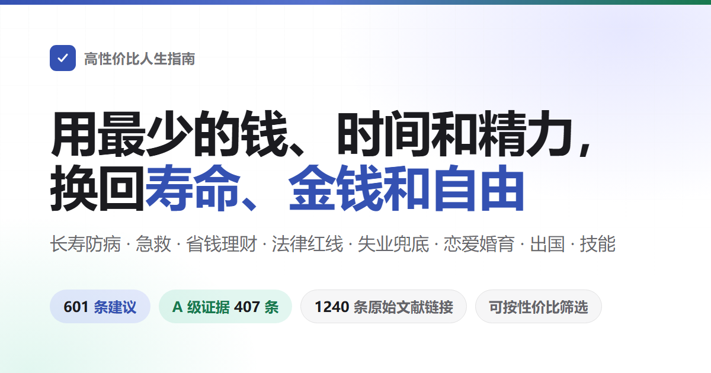

<div align="center">



# How to Live Better

How to live longer and get sick less, and what to do first when an accident happens. How to waste less money, which things get you scammed or sued. What you can claim when you have no job and no money, and what paperwork a shop, a company or a website needs. Also dating, marriage and children, going abroad, and learning a trade.<br>
601 recommendations, each stating what it costs, what it buys back, and how hard the evidence is - sources are journal papers and official documents only.

You don't have to do all of it: this is a menu ranked by value, not a to-do list - taking one or two entries counts, and the author hasn't done most of them either.

[](https://aeiouvcode.github.io/how-to-live-better/)
[](#contents)
[](#evidence-grades)
[](https://github.com/eternity4719/HowToLiveBetter/tree/main/docs/%E6%A0%B8%E5%AE%9E%E8%AE%B0%E5%BD%95)
[](LICENSE)

**[Open the searchable page](https://aeiouvcode.github.io/how-to-live-better/)** · [Contents](#contents) · [Glossary](#reading-the-numbers-glossary) · [Verification records (Chinese)](https://github.com/eternity4719/HowToLiveBetter/tree/main/docs/%E6%A0%B8%E5%AE%9E%E8%AE%B0%E5%BD%95) · [Is marriage worth it (long-form)](docs/is-marriage-worth-it.md) · [Home emergency kit list (long-form)](docs/home-emergency-kit-list.md) · [Should you stop for a stranger in trouble (long-form)](docs/should-you-stop-for-a-stranger.md) · [Licenses for running a platform (long-form)](docs/licenses-for-running-a-platform.md) · [Body clock and night shifts (long-form)](docs/body-clock-and-night-shifts.md)

**This is the English translation of [高性价比人生指南](https://github.com/eternity4719/HowToLiveBetter) by [eternity4719](https://github.com/eternity4719), released under the Unlicense (public domain), as is this translation.** Chapters on Chinese law, benefits and services stay China-specific on purpose: the statutes, hotlines, agencies and amounts are China's, translated but not localized away. Where the original author marked an item unverified (TODO), the mark is kept.

</div>

---

## The questions this book answers

| Question | Where to look |
| --- | --- |
| Which nearly-free things noticeably cut the chance of dying early? | [1. Don't Die Early](book/01-dont-die-early.md) |
| How much life do smoking, drinking, sitting still and staying up actually cost, and how exactly do you quit smoking and drinking? | [2. Don't Die Slowly](book/02-dont-die-slowly.md) |
| Not enough energy every day, constant interruptions - how do you fix it? | [3. Don't Waste Energy](book/03-dont-waste-energy.md) |
| Where does the time go, how do you do fewer zero-return things, how do you treat procrastination? | [4. Don't Waste Time](book/04-dont-waste-time.md) |
| Where should savings sit so interest, fees and scams don't eat them? | [5. Don't Waste Money](book/05-dont-waste-money.md) |
| Which supplements, checkup packages and IQ taxes can you simply not buy? | [6. The Negative List](book/06-the-negative-list.md) |
| Out of a job, owed wages, no money left - what can you claim, where do you ask for help? | [7. How to Live When You're Broke](book/07-living-with-no-money.md) |
| Who owns the bride price, pre-marital property and large transfers during a relationship; what's the first step when someone reports you to the police or files a fabricated accusation; how much does turning yourself in reduce a sentence; can you pursue and claim afterwards? | [8. Law and Property Safety](book/08-dont-get-yourself-in-trouble.md) |
| Which "side gigs" and casual favors turn an ordinary person into a criminal defendant? | [9. Legal Red Lines Ordinary People Trip Over](book/09-legal-red-lines-for-ordinary-people.md) |
| Should you cast a wide net or commit to one person, can long distance work, what do you bring to register a marriage? | [10. Is Dating and Marriage Worth It](book/10-is-dating-and-marriage-worth-it.md) |
| Which code and which freelance gigs get you a prison sentence? | [11. Red Lines for Programmers and Tech Workers](book/11-red-lines-for-programmers.md) |
| Before borrowing money to open a shop or a company, what must you think through first? | [12. Starting and Running a Business](book/12-starting-a-business.md) |
| Someone is down and not breathing, bleeding heavily, a fire, lost in the wild - what comes first? | [13. Emergencies: What to Do First](book/13-emergencies.md) |
| Account stolen, phone lost - what's the first step? | [14. Account and Information Security](book/14-account-and-information-security.md) |
| Deposit withheld, landlord throwing you out, a long-term rental platform collapses - what now? | [15. Renting and Buying a Home](book/15-renting-and-buying-a-home.md) |
| Diagnosed with a chronic disease - how do you manage it long-term and spend less? | [16. Living With a Chronic Disease](book/16-living-with-a-chronic-disease.md) |
| How should guardianship, wills and money be arranged ahead of time for elderly parents? | [17. When You Have Elderly Parents](book/17-elderly-parents-at-home.md) |
| What can you claim for having a child, and how much time and money does it take? | [18. Is Having Children Worth It](book/18-is-having-kids-worth-it.md) |
| How are overtime and annual leave calculated, how much severance is a layoff worth, how is a work injury recognized and paid? | [19. Employment, Leaving a Job, and Work Injuries](book/19-employment-leaving-and-work-injury.md) |
| The baby is just born - what are the few most urgent things? | [20. Caring for a Newborn](book/20-caring-for-a-newborn.md) |
| Which countries to avoid right now, and how far does an embassy or consulate actually go when things go wrong? | [21. Travel Abroad and Overseas Safety](book/21-traveling-abroad-and-overseas-safety.md) |
| How to enjoy KTV, internet cafes and escape rooms without stepping on landmines, and what works best under stress? | [22. How to Unwind: Entertainment Venues and Stress Relief](book/22-how-to-unwind.md) |
| Welding, English, certificates - which ones actually pay back, and how do you learn faster? | [23. Which Skills Are Worth Learning](book/23-which-skills-are-worth-learning.md) |
| How much cheaper is the community clinic than the tier-3 hospital for the same disease; badly hurt - queue for registration or find the triage desk; afterwards, should you get a disability assessment and certificate? | [24. Seeing a Doctor: Spend Less, Take Fewer Wrong Turns](book/24-seeing-a-doctor.md) |
| Someone in the family has died - what do you do right away, which money can be claimed back, which fees can you refuse? | [25. What to Do After Someone Dies](book/25-what-to-do-after-a-death.md) |
| A website or platform that takes money - which licenses, and where do the servers go? | [26. Building a Website or Platform](book/26-building-a-website-or-platform.md) |
| Pregnant, about to give birth - what happens when, and which certificates do you get before leaving the hospital? | [27. Pregnancy and Childbirth](book/27-pregnancy-and-childbirth.md) |
| Want to lose weight, want to look better - which approaches wreck your body? | [28. Don't Wreck Your Body for Looks](book/28-dont-wreck-your-body-for-looks.md) |
| A death in the family, a layoff, a serious diagnosis - what matters most in the first few months? | [29. After a Major Blow](book/29-after-a-major-blow.md) |
| Once kids are in school, which physical and mental things can't wait until after the exams? | [30. School-Age Children](book/30-school-age-children.md) |
| After eighteen, besides more school and odd jobs, what paths are there and what does each require? | [31. Paths After Eighteen](book/31-paths-after-eighteen.md) |
| Studying abroad - what counts as an unbroken visa status, and will the degree be recognized back home? | [32. Studying Abroad: Status, Work, Insurance and Degree Verification](book/32-studying-abroad.md) |
| You or a family member becomes disabled - which complications to prevent first, which benefits to claim, and how school, work and guardianship work? | [33. Living With a Disability](book/33-living-with-a-disability.md) |

## How to read this

- **You don't have to do all of it**: this is a menu ranked by value, not a to-do list. Take one or two entries and it counts; leave the rest and come back when you need it. "Easier said than done" is a fair review - the author hasn't done most of these either; they were written down so they can be found when needed. For the effortless picks, see "only the most worthwhile" below.
- **To pick by criteria**: open the [searchable page](https://aeiouvcode.github.io/how-to-live-better/) and filter by keyword, chapter or evidence grade, or by the three costs - "does it cost money, how much time, does it take willpower" - which stack. The page reads its content straight from the text in book/; change the text and the page follows.
- **Entries point at each other** ("see entry 16 of chapter 8"): on the search page these references carry a dotted underline. Tap one and the referenced entry's title and TL;DR appear in place; press "Jump there" to actually go. If that entry is hidden by your filters, the page clears them for you. Reading the raw text on GitHub, the references don't click, but each one names its target ("see entry 18 (write an IOU when lending money)"), so you know what it points at without turning there.
- **To read in order**: entries within each chapter run from best value to worst; start from the first few of each chapter.
- **To have an AI look things up for you**: the original Chinese repository ships a skill ([skills/life-decision-guide](https://github.com/eternity4719/HowToLiveBetter/tree/main/skills/life-decision-guide)) that Claude Code and Codex can install. It answers questions like "should I guarantee a friend's loan" by pulling the relevant entries, ranking them the book's way, and citing chapter and entry numbers - and says so when the book has no answer. It is in Chinese.
- **If the numbers look like gibberish**: every entry has a "TL;DR" line. It rewrites the research-speak of the "Benefit" field into plain words - "about 20% less likely to die in the same period", "so many days of detention, such a fine". It only restates what "Benefit" already says and adds no new numbers; that one line is enough to decide. "Benefit" keeps every number as written, for anyone who wants to check.
- **Only the hardest conclusions**: on the search page, tick evidence grade A to keep the 405 entries backed by concrete numbers from meta-analyses or large trials.
- **Only the most worthwhile**: tick value "Top" for the 104 entries that cost no money, no time and no willpower and still land in the biggest benefit tier. Stack a "What it buys" filter on top and you have the priority list for that lens.
- **Chapter titles starting with "Don't" are not a warning**: the title names what the chapter is trying to prevent (don't die early, don't waste time), not what every entry tells you to do. The action is in each entry's title, which always starts with a verb and says for itself whether it is "do this" or "don't do this". The same chapter has both: chapter 4 has both "write 'plan to do' as 'at what time, where, do what when something happens'" and "don't watch TV or rolling news". Read the entry titles, not the chapter title's mood.

Each recommendation looks like this:

```markdown
### 5. Swap your table salt for low-sodium salt (potassium salt)
- Cost: A bag costs a few yuan more than regular salt. Swap it in while shopping - no extra time. The taste barely changes.
- TL;DR: In a randomized trial of twenty thousand people, those who swapped their household salt for low-sodium salt were about 12% less likely to die within five years and about 14% less likely to have a stroke. Randomized into two groups, this is more trustworthy than numbers from follow-along observation.
- Benefit: A randomized trial in rural China with 20,995 people - all stroke survivors or hypertension patients over 60 - followed for 4.74 years. Result: the low-sodium group had about 12% lower mortality risk than the regular-salt group (RR 0.88). Stroke about 14% lower (RR 0.86). Major cardiovascular events about 13% lower (RR 0.87).
- Evidence: A
- Sources: Neal B et al. (2021). Effect of Salt Substitution on Cardiovascular Events and Death. NEJM. https://doi.org/10.1056/NEJMoa2105675
- Notes: Disputed. The subjects were high-risk elderly people; healthy young people gain much less from switching. People with kidney insufficiency, or on potassium-sparing medication, should ask a doctor before switching.
```

## Run your own copy

Most people don't need to deploy anything: the [searchable page](https://aeiouvcode.github.io/how-to-live-better/) is already up.

To run it on your own machine or server:

```bash
git clone https://github.com/aeiouvcode/how-to-live-better.git
cd how-to-live-better
python -m http.server 8000
```

Then open `http://localhost:8000/` in a browser. The search page is purely static - `README.md` and `book/` are its data; there is no backend, no database, no dependencies, and dropping the directory onto any static host (Nginx, GitHub Pages, object storage) works the same. Note that `index.html` must be served over http: opened as a local file it stays blank, because browsers don't let pages read local files.

## The four resources

This book tries to help you keep more than lifespan - four things in total:

- **Lifespan**: live longer, die less from avoidable causes
- **Time and energy**: don't spend your living time on zero-return things, and don't let each day's attention and stamina drain away for nothing
- **Money**: waste less of it, spend it where the return is certain
- **Personal freedom**: don't land yourself in a detention cell because you didn't know a red line

Every recommendation answers two questions: what does it cost (money / time / energy / willpower), and what does it buy back (change in all-cause mortality / a drop in a specific cause of death / time and energy saved / money saved / safety nets and personal freedom). Entries are ranked by value, not by category: whatever costs almost nothing and buys back a lot goes first.

**Who an entry's benefit lands on is tiered.** Ranked by "how likely is this benefit to come back to you": ① **yourself**; ② **spouse and immediate family** (parents, children, grandparents, grandchildren); ③ **friends, coworkers and other relatives** - reciprocal relationships, where help given may come back; ④ **strangers** - the lowest tier, but not zero: the chance of payback is small, you don't know the other person's character, and there is a side of being framed, bitten back, or retaliated against. Tiers are never added together; when an entry reaches tier ④, the benefit and the risk are written together.

Read the first-aid chapter this way: of 38,227 out-of-hospital cardiac arrests in China, 79.2% happened at home - learning compressions is first of all for pressing on your own family. Rules like "don't go into the water yourself when someone is drowning" and "don't wade into a street fight to break it up" are self-protection rules: they keep you from turning from bystander into casualty number two. Whether to act for a stranger is your own call; the entries spell out the liability shields, the self-protection moves and the risk surface, and don't count it as an obligation for you.

Mortality numbers, time-and-energy numbers, money numbers and legal consequences each stand on their own and are never converted into each other. These are the four "What it buys" filters on the search page, and they are never ranked against each other.

## Evidence grades

Every recommendation carries an evidence grade:

| Grade | Meaning |
| --- | --- |
| A | A concrete number you can look up, from a meta-analysis combining many studies, a large cohort following many people for years, or a randomized controlled trial (RCT), able to say by how much (HR, RR, percentage reduction) |
| B | Supported by research, but no exact number can be given; or only small samples or a single study behind it |
| C | The author's own experience, or a generally accepted practice, with no direct research literature |

Of the 601 entries, 407 are grade A, 144 grade B and 50 grade C; another 55 are marked disputed and 37 carry TODO unverified marks. Disputed A/B entries are marked "Disputed" and list the counter-evidence. All sources are primary literature only (journal papers with a DOI or PubMed link, or reports from official bodies such as the WHO, CDC or the National Bureau of Statistics) - no secondhand retelling. Numbers the author couldn't verify are marked "unverified".

## The value tiers

The evidence grade only answers "can this number be trusted", not "is this worth doing". So each entry also carries two more marks: benefit size (how big the gain is) and lens (which kind of thing it buys back). The search page combines those two with the three costs into a value tier:

| Dimension | Values | How it's set |
| --- | --- | --- |
| Lens | Buys lifespan / buys money / buys time & energy / buys freedom | What the entry mainly buys back. **No comparisons across lenses** - "all-cause mortality down 12%" and "500 yuan saved a year" are not on the same ruler |
| Benefit size | Big / medium / small | Read off the entry's own "Benefit" field against pre-set boundaries, not by feel: for lifespan, the percentage reduction (≥20% big, 10-20% medium, <10% - or only a surrogate marker rather than the final outcome - small); for money, the amount (tens of thousands of yuan big, hundreds to thousands medium, tens small); for freedom, the consequence (avoiding criminal liability big, avoiding detention or administrative punishment medium, avoiding a civil dispute small); for time & energy, how much is saved (hours a day big, hours a week medium, a one-off saving small) |
| Value | Top / high / fair | Big benefit with all three costs at zero = Top; big benefit with modest costs, or medium benefit at zero cost = High; everything else = Fair |

Of the 601 entries, 104 (17%) are Top, 274 (46%) High and 223 (37%) Fair. The middle tier being crowded is deliberate: benefit size only comes in big, medium and small, and slicing finer would be fake precision.

**This tier is the author's own judgment, not evidence** - by this book's own standard it is itself grade C; it and the evidence grade are separate things and neither moves the other. An entry can be grade A yet only Fair value (the shingles vaccine has 97.2% efficacy in a phase-3 RCT, but the two shots cost three to four thousand yuan and shingles rarely kills), and an entry can be grade C yet Top value (sending your itinerary to family before going abroad). "Fair" does not mean don't do it - every entry in the book is a recommendation; it only means you have to weigh that expense yourself.

## Reading the numbers (glossary)

The text sticks to everyday wording, but quoting research makes a few statistical terms unavoidable. Look them up here; on the search page, hovering over (or tapping) a dotted term shows the same explanation.

<details>
<summary>Expand the 41 terms (all-cause mortality, HR, RR, 95% CI, meta-analysis, BMI, LPR, earnest money vs advance payment...)</summary>

| Term | Meaning |
| --- | --- |
| all-cause mortality / ACM | The share of a group of people who die within a period, whatever the cause. This book uses it to measure "living longer". The original research calls it all-cause mortality, abbreviated ACM |
| HR | Hazard ratio. Over the same period, how fast the group that did something runs into trouble (death, disease), divided by the group that didn't. HR 0.87 means 13% lower than the non-doing group; HR 1.21 means 21% higher |
| RR | Relative risk. The ratio of the two groups' chances of running into trouble; read it the same way as HR |
| OR | Odds ratio. Also a two-group comparison, computed slightly differently from RR: when the event is rare it is close to RR; when the event is common it overstates the gap |
| IRR | Incidence rate ratio. The incidence rate is the share of people who newly get a disease within a period; divide the two groups and read it like RR |
| RaR | Rate ratio. Compares how many times something happened (say, how many falls), not how many people were hurt; read it like RR |
| standardized mortality ratio / SMR | How many people in this group actually died, divided by "how many ordinary people of the same age should have died". 5.86 means 5.86 times as many deaths as same-age peers |
| risk difference | One group's probability of trouble minus the other's - it directly gives "how many extra cases per thousand people". A multiple only says how many times bigger; the risk difference says how many real extra people |
| 95% CI | 95% confidence interval. Every number a study produces has error; this is the range the truth most likely falls in. For ratio-type numbers, if the range crosses 1, and for difference-type numbers, if it crosses 0, the gap between the groups may be pure chance - the text says "not statistically significant" |
| RCT | Randomized controlled trial. People are split into two groups lottery-style; one does the thing, one doesn't, and the outcomes are compared afterwards. The most convincing way to prove "this thing did it" |
| meta-analysis | Pooling the results of many studies and computing one overall number. Also called a meta analysis |
| cohort / cohort study | Following a large group of people for years and recording who runs into trouble. It can show two things tend to appear together, but not that the first caused the second |
| observational / observational study | The researcher only records from the sidelines and arranges nothing. Results are easily skewed by other factors (see confounding and reverse causation in this table), so discount the numbers somewhat |
| confounding | A third factor drives both the apparent cause and the outcome, making the two look causally linked. People who love vegetables often also exercise more; you can't tell which one is working |
| reverse causation | The arrow points the other way: it looks like the first thing caused the second, but the second caused the first. It's not that sleeping long makes people die early - it's that very sick people sleep long |
| effect size d / effect size g | Effect size: how big the gap between two groups is, converted into "how many times the usual wobble". 0.2 counts as small, 0.5 medium, 0.8 large |
| correlation r | Correlation coefficient: how tightly two things move together, from -1 to 1. 0.1 counts as weak, 0.3 medium, 0.5 strong |
| MET | A unit of exercise intensity. Sitting still is 1 MET, brisk walking about 3 to 4 MET. Written as MET·h, intensity times hours, it measures total movement |
| GRADE | An internationally used system for rating how reliable a piece of evidence is, in four tiers: high, moderate, low, very low |
| intention-to-screen analysis | Counting the effect by "who was invited to screen", not "who actually went". Some invitees never go, so this method understates the benefit of screening for those who do go |
| pack-years | A unit for lifetime smoking: packs per day times years. 30 pack-years is a pack a day for 30 years |
| BMI | Body mass index, the usual fatness number: weight in kilograms divided by height in meters squared |
| LDL | Low-density lipoprotein cholesterol, the "bad cholesterol" |
| eGFR | Estimated glomerular filtration rate, a measure of kidney filtering capacity in mL/min/1.73 m². Lower means worse kidney function; chronic kidney disease stages are set by it |
| HBsAg | Hepatitis B surface antigen, a line on the lab report. Positive means a current hepatitis B virus infection |
| HPV | Human papillomavirus. It has many types; long-term infection with some of them causes cervical cancer |
| LDCT | Low-dose chest CT, at about a fifth to a tenth of the radiation of a regular CT |
| PM2.5 | Fine particles floating in the air, under 2.5 micrometers across |
| NOVA | A food classification system with four categories by degree of processing; "ultra-processed food" is the fourth |
| LPR | Loan Prime Rate. China's benchmark lending rate, published on the 20th of each month; mortgage rates and the interest cap on private lending are both set off it |
| final and binding arbitration | The labor-arbitration award takes effect immediately; the employer cannot take the same matter to court |
| crude marriage rate / crude divorce rate | The number of marriages or divorces registered in a year per thousand people. There is also the divorce-to-marriage ratio - that year's divorces divided by marriages - which is a different number; don't mix them up |
| AED | Automated external defibrillator. The red or yellow emergency box in public places; turn it on and follow the voice prompts - it decides for itself whether to shock |
| CPR | Cardiopulmonary resuscitation: pressing hard on the chest during cardiac arrest to keep blood moving |
| 3C certification | China Compulsory Certification. Products in the catalogue may not leave the factory or be sold without this mark |
| ICP filing | A registration step in the Ministry of Industry and Information Technology's system before a website or app officially goes live |
| MLPS | China's multi-level protection scheme for cybersecurity. Systems are graded by importance; the higher the grade, the more security measures are required |
| GPL | An open-source license. Things built with such code generally must publish their own code too when distributed |
| non-compete / non-compete clause | An agreement with an employer: for a period after leaving, you don't work for a direct competitor. The employer pays monthly compensation for that period, at most 2 years |
| subscribed capital | The money you promise to put in when registering a company. A promise must actually be paid within the legal deadline - it is not a decorative number |
| earnest money / advance payment | Two Chinese words that differ by one character (定金 dingjin vs 订金 dingjin) but very different force: earnest money carries a penalty - the side receiving it must return double if it backs out, and it can be at most 20% of the contract amount; an advance payment is just money paid early, and backing out carries no such penalty |

</details>

## Contents

1. [Don't Die Early](book/01-dont-die-early.md): external causes of death, gas and poisoning, vaccines, screening, the time scale of mental-health crises and suicidal thoughts, what remains after being saved, the year after a serious fall, the math of the kidney left behind after selling one, home emergency gear, and warning signs like visible blood in urine. Lens: all-cause or cause-specific mortality.
2. [Don't Die Slowly](book/02-dont-die-slowly.md): smoking and drinking, exercise, sleep, diet, prolonged sitting, plus concrete ways to quit (quit-smoking medication, quit days, quit clinics and hotlines, e-cigarettes, and why alcohol withdrawal must not be ridden out alone), nap length, how to recover after staying up, and the math of years on night shifts. Lens: all-cause or cause-specific mortality. Long-form: [docs/body-clock-and-night-shifts.md](docs/body-clock-and-night-shifts.md).
3. [Don't Waste Energy](book/03-dont-waste-energy.md): sleep, interruptions, multitasking, decision fatigue, relationship debt, and the expectations to bring when dealing with institutions. Lens: energy/time.
4. [Don't Waste Time](book/04-dont-waste-time.md): zero-return projects, sunk costs, procrastination (the emotional explanation, changing the environment, commitment devices, how long habits take, self-help materials), meetings, commuting. Lens: time.
5. [Don't Waste Money](book/05-dont-waste-money.md): subscriptions, lotteries, interest, insurance, fund fees, personal pensions, car insurance, prepayments, livestream sales, medical-insurance personal accounts, kids getting scammed and top-up refunds, why bracelets, luxury watches and designer toys don't count as investing, how to verify a jade appraisal report, blind boxes and gacha. Lens: money.
6. [The Negative List](book/06-the-negative-list.md): things that look cost-effective but aren't, including the claim that "willpower runs out".
7. [How to Live When You're Broke](book/07-living-with-no-money.md): relief, subsidies, finding work, food and shelter, medical care, defending unpaid wages, avoiding traps. Lens: money/safety nets.
8. [Don't Get Yourself in Trouble: Law and Property Safety](book/08-dont-get-yourself-in-trouble.md): traffic accidents, freezing fraudulent transfers, AI face- and voice-swapping, how much turning yourself in and truthful confession reduce a sentence and why "riding out the limitation period" doesn't work, the paths after being accused or falsely reported, the line between using a report to extort money and claiming what you're owed, conflict and rage-driven extreme violence, urges to hurt people and the family's right to have you committed, the four legal gates after insuring a family member and then acting, using platforms and injunctions after being cyberbullied, bride price, pre-marital property, guarantees, anti-fraud, limitation periods, enforcement and the defaulter list, dog-owner liability, the case-acceptance receipt after reporting to police and remedies when they won't file, and why paying to make trouble go away is bribery. Lens: money/personal freedom.
9. [Legal Red Lines Ordinary People Trip Over](book/09-legal-red-lines-for-ordinary-people.md): rumors, insulting martyrs, viewing-but-not-forwarding overseas content, spreading pornography, money-laundering side gigs, forged loan materials, staged accidents for insurance, objects thrown from height, replica guns, drones, secret filming, the line between lawful adoption when you can't raise a child and trafficking or abandonment, gambling, wild game, selling organs and brokering donors. Lens: personal freedom/money.
10. [Is Dating and Marriage Worth It](book/10-is-dating-and-marriage-worth-it.md): search strategy, harassment red lines, interest signals, relationship quality, long distance, the registration process, premarital checkups, health math, time math, money math, parents funding a home purchase and joint marital debt, exit costs. Long-form: [docs/is-marriage-worth-it.md](docs/is-marriage-worth-it.md).
11. [Red Lines for Programmers and Tech Workers](book/11-red-lines-for-programmers.md): game cheats, scrapers, ticket-sniping scripts, deleting the database, taking source code, freelance gigs, non-competes, open-source licenses, filings. Lens: personal freedom/money.
12. [Starting and Running a Business: Don't Lose the Family Savings](book/12-starting-a-business.md): capital, guarantees, entity choice, registration, licenses, tax filing, invoices, tax scams, contracts, hiring, mass production, the IP red lines in sourcing stock and using images, exit. Lens: money/legal liability.
13. [Emergencies: What to Do First](book/13-emergencies.md): cardiac arrest, stroke and posterior-circulation stroke, eye stroke, heart attack, aortic dissection, thunderclap headache, chronic subdural hematoma, pulmonary embolism, major bleeding, bites, burns, anaphylaxis, seizures, hypoglycemia, electric shock, carbon monoxide, poisoning and chemical burns, embedded foreign objects, fracture splinting, scams, privacy threats, heatstroke, fires, drowning, getting lost, hypothermia, snakebites, earthquakes, wild animals, lightning, altitude sickness, ticks, drinking water in the wild; plus whether you can afford to help: how to lift a fallen elderly person, what to do when you witness a fight, and who pays when you're hurt rescuing someone. Lens: survival and money, with the last few entries touching personal freedom.
14. [Account and Information Security](book/14-account-and-information-security.md): two-factor authentication, passwords, SIM cards, lost phones, card fraud, logged-in devices, app permissions, facial recognition, access and deletion rights. Lens: money/personal information.
15. [Renting and Buying a Home](book/15-renting-and-buying-a-home.md): deposits, violent eviction, agents collecting rent, escrow supervision, sale doesn't break lease, title checks, transaction escrow accounts, partitioned rooms. Lens: money.
16. [Living With a Chronic Disease](book/16-living-with-a-chronic-disease.md): medication adherence, cross-province outpatient settlement for chronic and special diseases, follow-up records, don't stop medication to try folk remedies, long-term prescriptions, family-doctor sign-up, complication screening, kidney-stone recurrence prevention, treat-to-target for gout. Lens: all-cause mortality/money.
17. [When You Have Elderly Parents](book/17-elderly-parents-at-home.md): voluntary guardianship, will formats, accounts and scripts, investment-for-retirement and house-for-pension scams, long-term care insurance, pressure-ulcer prevention for the bedridden. Lens: money/personal freedom, with the pressure-ulcer entry on mortality.
18. [Is Having Children Worth It](book/18-is-having-kids-worth-it.md): childcare subsidies, maternity leave and the birth allowance, protection during pregnancy, childbirth and nursing, time math, money math. Lens: money/time.
19. [Employment, Leaving a Job, and Work Injuries](book/19-employment-leaving-and-work-injury.md): overtime pay, annual leave, probation; occupational-hazard disclosure and the three checkups, dust and noise protection; severance N, payment in lieu of notice, 2N, don't sign a voluntary resignation, keep evidence; work-injury recognition deadlines, employer without insurance, work-capacity assessment, death benefits. Lens: money.
20. [Caring for a Newborn](book/20-caring-for-a-newborn.md): safe sleep, the first hepatitis B shot, national immunization vaccines, breast milk and solids, formula water temperature, honey, vitamin K, fever red lines, no shaking, diapers and big purchases, early peanut introduction for high-risk babies. Lens: infant mortality/money.
21. [Travel Abroad and Overseas Safety](book/21-traveling-abroad-and-overseas-safety.md): travel advisory levels, the 12308 hotline, the limits of consular protection, overseas medical insurance, overseas high-pay job scams, the annual quota for overseas cash withdrawals, lost documents, foreign driver's licenses, agent registration. Lens: money/personal freedom.
22. [How to Unwind: Entertainment Venues and Stress Relief](book/22-how-to-unwind.md): emergency exits, posted prices, drug red lines, things strangers hand you, real-name internet cafes, escape-room and script-kill locations; exercise, mindfulness, breathing, socializing, green space. Lens: money/personal freedom, plus energy/all-cause mortality.
23. [Which Skills Are Worth Learning](book/23-which-skills-are-worth-learning.md): school versus work (the child-labor age line, education and mortality, the national education structure, free tuition and grants and student loans, the vocational-school path upward, how to run the math yourself), returns to education, fake certificates, training subsidies, which skills machines replace last, skill levels, how to look up shortage occupations, and how to learn once you've picked (self-testing, spaced practice, don't rely on highlighting, interleaving, no evidence for learning styles). Lens: money/time, with one entry on mortality.
24. [Seeing a Doctor: Spend Less, Take Fewer Wrong Turns](book/24-seeing-a-doctor.md): tiered care and referrals, deductible continuity, reimbursement-rate gaps, reserved appointment slots, assessing whether out-of-town care is necessary, keeping and sealing medical records, the four-level emergency triage order, emergency medical aid when you can't pay, the timing of disability assessment, how to get a disability certificate, no need to give doctors red envelopes. Lens: money/time.
25. [What to Do After Someone Dies](book/25-what-to-do-after-a-death.md): calling the police and the death certificate, body transport and cremation, disputing the cause of death and autopsy, cancelling the household registration, the basic funeral service list, price violations, agent registration, housing-fund balances and social-insurance benefits, the deceased's personal-information rights. Lens: money.
26. [Building a Website or Platform: Licenses, Filings and Servers](book/26-building-a-website-or-platform.md): payment-settlement red lines, ICP licenses and filings, livestream and audiovisual permits, platform verification and tax reporting, content governance, real-name rules, minors, notice-and-takedown, data export, server choices. Lens: personal freedom/money. Long-form: [docs/licenses-for-running-a-platform.md](docs/licenses-for-running-a-platform.md).
27. [Pregnancy and Childbirth: From Finding Out to Leaving the Hospital with Papers](book/27-pregnancy-and-childbirth.md): folic acid, registration and free prenatal checkups, three-disease screening and mother-to-child transmission blocking, smoking and drinking in pregnancy, aspirin and gestational diabetes, go-to-hospital-now signs, handling ruptured waters, painless delivery, C-section indications, maternity insurance, the birth medical certificate, newborn screening, insurance and household registration, the 42-day postpartum checkup. Lens: mortality and money.
28. [Don't Wreck Your Body for Looks](book/28-dont-wreck-your-body-for-looks.md): extreme dieting and eating disorders, the two certificates for medical-cosmetology institutions and their lead physicians, the blindness sites in facial fillers, weight-loss products illegally laced with sibutramine, anabolic steroids, prescriptions and follow-ups for weight-loss drugs and sex hormones, body-image assessment. Lens: mortality (health outcomes), with the two medical-cosmetology entries also touching personal freedom.
29. [After a Major Blow](book/29-after-a-major-blow.md): the cardiovascular window in the first month of bereavement, the first week after a serious diagnosis, job loss, the half year after losing a spouse, losing someone to suicide, substitutes when there is no one, children who lose a parent, where to register when grief gets stuck, divorce, the 12356 and 12355 hotlines, no irreversible decisions under stress, why dying to escape debt doesn't work. Lens: all-cause mortality, with the four entries about spending and benefits on money.
30. [School-Age Children](book/30-school-age-children.md): emergencies measured in hours, don't delay treatment for exams, what to do about bullying, 2 hours outdoors daily, student physical reports, teen depression screening, "myopia cure" products, hard rules on sleep and homework, leave of absence with enrollment kept, dilation eye exams and follow-ups, pit-and-fissure sealants. Lens: mortality and health outcomes, plus one or two entries each on money and time.
31. [Paths After Eighteen](book/31-paths-after-eighteen.md): the legal thresholds of twelve paths; the military (service registration, two years as a conscript, joint punishment for draft dodging, tuition compensation and further education, placement and the 30-day report, discharge pay and seniority and taxes); targeted civil-service hiring from grassroots service programs; special-post teachers getting tenure after their term; firefighters and civilian military staff; self-taught exams, the adult gaokao and the Open University; the 6-year service obligation of publicly funded teachers and targeted medical students; what kind of company to look for when working abroad; income tax and foreign-exchange receipts for working remotely for an overseas company from home; startup guarantee loans; social insurance for flexible employment; occupational injury protection for delivery riders. Lens: money/time, with the draft-dodging entry also touching personal freedom.
32. [Studying Abroad: Status, Work, Insurance and Degree Verification](book/32-studying-abroad.md): check the accredited-school list before paying tuition; the US fixed admission period starting September 2026 and the 30-day departure window; work-hour caps in the US, Canada, the UK and Australia; full-time enrollment as the root of your status; reporting a move within 10 days; Ministry of Education study-abroad alerts; Australia's OSHC must not lapse; the UK's immigration health surcharge; the 10 to 20 working days for degree verification; the enhanced-review school list. Lens: money/personal freedom.
33. [Living With a Disability](book/33-living-with-a-disability.md): the three on-the-spot steps for autonomic dysreflexia, the ten-year suicide window after disability, the voluntary principle of psychiatric admission and its two exceptions, caregivers' own mortality risk, wheelchair pressure-relief cushions, cure scams, the six benefits to ask about after getting certified, long-term care insurance beyond the elderly, rehab aid for ages 0-6, home accessibility renovation subsidies, quota employment and the disability employment security fund, income-tax reductions, guide dogs and free transit, reasonable accommodations in the gaokao, schools may not refuse admission and must teach at the door, the C5 license, choosing a rehab facility, hearing aids, capacity assessment and guardianship. Lens: mortality/money/time/personal freedom.

Entries within each chapter run from best value to worst. Chapter titles like "Don't Die Early" or "Don't Waste Time" name the outcome the chapter is trying to prevent; whether an entry itself says do or don't is up to the entry's title. Long-form pieces: [docs/home-emergency-kit-list.md](docs/home-emergency-kit-list.md), [docs/licenses-for-running-a-platform.md](docs/licenses-for-running-a-platform.md), [docs/is-marriage-worth-it.md](docs/is-marriage-worth-it.md), [docs/should-you-stop-for-a-stranger.md](docs/should-you-stop-for-a-stranger.md) and [docs/body-clock-and-night-shifts.md](docs/body-clock-and-night-shifts.md). The verification process behind every source is recorded (in Chinese) in [docs/核实记录](https://github.com/eternity4719/HowToLiveBetter/tree/main/docs/%E6%A0%B8%E5%AE%9E%E8%AE%B0%E5%BD%95) of the original repository.

The `index.html` at the repository root is the searchable page: filter entries by keyword, chapter, evidence grade and the cost dimensions (money, time, willpower); it reads its data straight from this file and book/. Enable GitHub Pages in the repository settings (Deploy from a branch, branch main, directory /) and it is live.

## The text

The text is split into 33 files under [book/](book/) - follow the chapter names in the contents above. The split exists because a single file would exceed GitHub's 512 KB Markdown rendering limit and the later chapters would not display; the [searchable page](https://aeiouvcode.github.io/how-to-live-better/) reads these files together and works the same.

## Original project

Translated from [eternity4719/HowToLiveBetter](https://github.com/eternity4719/HowToLiveBetter) (Chinese, Unlicense). The original's audit trail (引用对照 and 核实记录) lives there. The original also ships EPUB/PDF/offline-HTML builds and a Chinese AI skill; this translation keeps the web reading experience.

## Ad (from the original author)

<a href="https://4.mcyyy.com"></a>
